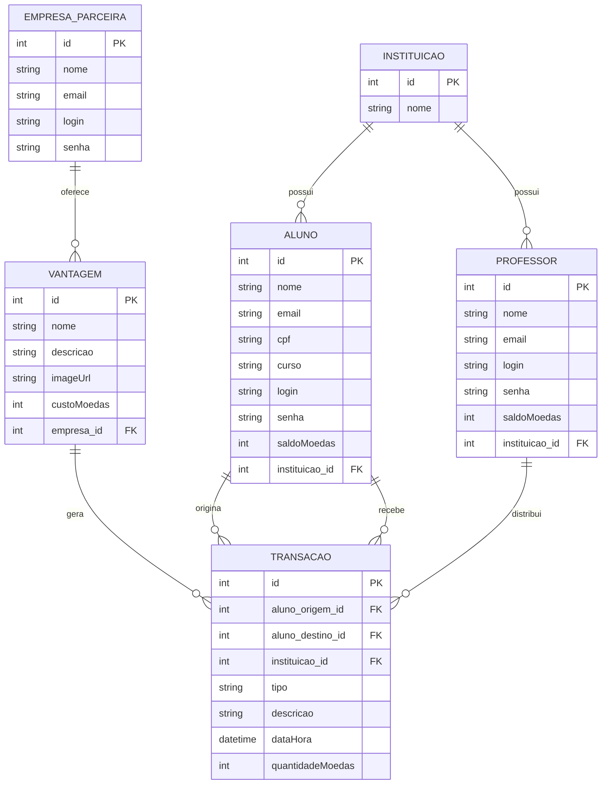

# Moeda Estudantil – Release 2

Sistema de moeda virtual para estudantes com autenticação por perfil, dashboards específicos e fluxo completo de distribuição, transferência e resgate de moedas acadêmicas.

## Destaques desta release

- ✅ Spring Security ativo com perfis de Aluno, Professor e Empresa (login em `/login`)
- ✅ Professores distribuem moedas para seus alunos e recebem crédito automático de +1000 a cada semestre
- ✅ Resgate de vantagens com geração de cupom, baixa de saldo e envio de e-mail HTML
- ✅ Dashboards por persona (aluno, professor, empresa) e histórico consolidado em `/moedas`
- ✅ Persistência em PostgreSQL (Railway) com suporte a H2 em memória para desenvolvimento

## Tecnologias

- Java 17
- Spring Boot 3.1.6 (Web, Data JPA, Validation, Security, Mail, Scheduler)
- Spring Data JPA + PostgreSQL 15 (Railway) / H2 (dev)
- Thymeleaf 3 + Layout fragments
- Maven 3.9+
- Scripts `run-fast.(bat|sh)` e configurações VS Code para start rápido

## Pré-requisitos & configuração

1. **Instale** Java 17 e Maven 3.9+.
2. (Opcional) Provisionar PostgreSQL local. O projeto aponta por padrão para o banco Railway compartilhado:
   ```
   SPRING_DATASOURCE_URL=jdbc:postgresql://yamabiko.proxy.rlwy.net:19408/railway?sslmode=require
   SPRING_DATASOURCE_USERNAME=postgres
   SPRING_DATASOURCE_PASSWORD=<ver .properties>
   ```
   Recomenda-se sobrescrever essas variáveis no ambiente local ou em um arquivo `application-local.properties` (não versionado).
3. Configure o envio de e-mail ou desabilite com `app.mail.enabled=false`. Para Gmail:
   ```
   SPRING_MAIL_HOST=smtp.gmail.com
   SPRING_MAIL_USERNAME=<sua-conta>
   SPRING_MAIL_PASSWORD=<app-password>
   SPRING_MAIL_PROPERTIES_MAIL_SMTP_STARTTLS_ENABLE=true
   ```

> **Dica:** para testar sem e-mail real, mantenha `app.mail.enabled=false`. O serviço fará log da mensagem simulada no console.

## Diagramas de Sequência

# Cadastro de Vantagem


# Visualização de Vantagem


# Resgatar Vantagem


## Como rodar

| Opção | Comando | Observações |
| --- | --- | --- |
| VS Code (recomendado) | Use a configuração **Run MoedaEstudantilApplication (Fast)** (`Ctrl+Shift+D` → F5) | JVM com `-noverify -XX:TieredStopAtLevel=1` |
| Script rápido | `run-fast.bat` (Windows) ou `./run-fast.sh` (Linux/Mac) | Empacota e sobe o Spring Boot com as flags otimizadas |
| Maven puro | `mvn clean install` (1ª vez) e depois `mvn spring-boot:run -Dspring-boot.run.jvmArguments="-noverify -XX:TieredStopAtLevel=1"` | Usar `SPRING_PROFILES_ACTIVE=dev` para apontar para outro banco |

Aplicação: http://localhost:8080  
Login: http://localhost:8080/login  
H2 Console (opcional): habilite `spring.h2.console.enabled=true` e acesse `http://localhost:8080/h2-console`.

## Usuários de teste (dados gerados pelo `DataInitializer`)

| Perfil | Login | Senha | Observações |
| --- | --- | --- | --- |
| Aluno | `joao` | `senha` | João da Silva, saldo sincronizado com transações |
| Professor | `maria` | `senha` | Professora na Universidade X com 1000 moedas por semestre |
| Empresa | `cantina` \| `livraria` | `senha123` | Empresas parceiras capazes de cadastrar vantagens |

Senhas legadas são migradas automaticamente graças ao `MigratingPasswordEncoder`, permitindo login mesmo que o hash ainda não exista.

## O que foi implementado na Sprint 3

- ✅ CRUD completo de Professores com associação a Instituições
- ✅ Entidades e repositórios para Transação e Vantagem
- ✅ Fluxos de transferência:
  - Professor ➜ Aluno (com e-mail para ambos)
  - Aluno ➜ Aluno (legado, mantido para compatibilidade)
- ✅ Resgate de vantagem + geração de cupom e e-mail HTML
- ✅ Feed de transações filtrado por perfil em `/moedas`
- ✅ Scheduler semestral que credita +1000 moedas para cada professor
- ✅ Layouts e dashboards dedicados para cada persona

## Funcionalidades

### Alunos
- CRUD completo e associação à instituição
- Dashboard com saldo, histórico e atalhos
- Transferência para outros alunos (fluxo legado)
- Resgate de vantagens com cupom e histórico vinculado

### Professores
- Cadastro, edição e consulta com vínculo à instituição
- Distribuição de moedas apenas para alunos da mesma instituição
- Recebimento automático de 1000 moedas (1º/01 e 01/07) via `ScheduledSemesterCredit`
- Notificações por e-mail sobre transferências enviadas

### Empresas Parceiras
- CRUD e dashboard próprio
- Cadastro/edição/remoção de vantagens com custo em moedas e imagem
- Visão consolidada das vantagens ativas

### Vantagens, moedas e notificações
- Resgate de vantagens gera transação `RESGATE`, baixa saldo e dispara template `email/cupom.html`
- Transferências professor ➜ aluno disparam `email/transfer.html` (aluno) e `email/transfer-professor.html` (professor)
- Página `/moedas` mostra histórico filtrado por perfil (aluno vê suas transações, professor vê da própria instituição)

## Modelo Entidade-Relacionamento



## Estrutura do projeto

```
moeda-estudantil/
├─ pom.xml
├─ run-fast.bat / run-fast.sh
├─ README.md
├─ src/main/java/br/edu/moedaestudantil/
│  ├─ MoedaEstudantilApplication.java
│  ├─ config/
│  │  ├─ DataInitializer.java
│  │  ├─ GlobalControllerAdvice.java
│  │  ├─ MailConfig.java
│  │  ├─ MigratingPasswordEncoder.java
│  │  ├─ SecurityConfig.java
│  │  └─ WebConfig.java
│  ├─ controller/
│  │  ├─ AlunoController.java
│  │  ├─ AuthController.java (legacy placeholder)
│  │  ├─ EmpresaController.java
│  │  ├─ ExtratoController.java
│  │  ├─ HomeController.java
│  │  ├─ LoginController.java
│  │  ├─ MoedaController.java
│  │  ├─ ProfessorController.java
│  │  └─ VantagemController.java
│  ├─ dto/
│  │  ├─ AlunoForm.java
│  │  ├─ EmpresaForm.java
│  │  └─ ProfessorForm.java
│  ├─ model/
│  │  ├─ Aluno.java
│  │  ├─ EmpresaParceira.java
│  │  ├─ Instituicao.java
│  │  ├─ Professor.java
│  │  ├─ Transacao.java
│  │  └─ Vantagem.java
│  ├─ repository/
│  │  ├─ AlunoRepository.java
│  │  ├─ EmpresaRepository.java
│  │  ├─ InstituicaoRepository.java
│  │  ├─ ProfessorRepository.java
│  │  ├─ TransacaoRepository.java
│  │  └─ VantagemRepository.java
│  └─ service/
│     ├─ AlunoService.java
│     ├─ CustomUserDetailsService.java
│     ├─ EmailService.java
│     ├─ EmpresaService.java
│     ├─ MoedaService.java
│     ├─ ProfessorService.java
│     ├─ ScheduledSemesterCredit.java
│     └─ VantagemService.java
├─ src/main/resources/
│  ├─ application.properties
│  ├─ data.sql (exemplo – execução desabilitada)
│  ├─ static/
│  │  ├─ css/styles.css
│  │  ├─ img/ (logo e ilustrações de login)
│  │  └─ js/main.js
│  └─ templates/
│     ├─ fragments/{header, footer, alerts}.html
│     ├─ dashboards: dashboard-aluno.html, dashboard-professor.html, dashboard-empresa.html
│     ├─ login.html e index.html
│     ├─ módulos: aluno/, empresa/, professor/, vantagem/, moeda/, extrato.html
│     └─ email/{cupom, transfer, transfer-professor}.html
└─ Artefatos/ (diagramas UML e ER)
```

## Próximos passos (Sprint 4)

- [ ] Fluxo de validação de cupons pela empresa (scan/QrCode)
- [ ] Aprovação de resgates pendentes e expiração automática de vantagens
- [ ] Dashboard analítico com gráficos (saldo médio, top vantagens, ranking)
- [ ] API REST pública para consumo por app mobile
- [ ] Cobertura de testes automatizados + pipeline CI/CD

## Dados iniciais

- 2 Instituições: Universidade X e Faculdade Y
- Professora Maria Oliveira recebe 1000 moedas iniciais e representa a instituição X
- Aluno João da Silva (Universidade X) inicia com saldo 0
- Empresas Cantina Universitária e Livraria Campus disponibilizam vantagens base

Os dados são criados apenas quando a base está vazia (`DataInitializer`). Em bancos existentes, o script garante que todos os professores tenham pelo menos 1000 moedas.

## Desenvolvimento

- Cache do Thymeleaf está desabilitado (`spring.thymeleaf.cache=false`) para facilitar hot reload
- `spring.jpa.open-in-view=false` e SQL formatado no log para depuração
- Segurança habilitada; páginas públicas restritas a `/login`, assets e formulários de cadastro
- Para usar H2 em memória, altere `spring.datasource.url=jdbc:h2:mem:moedadb`, habilite `spring.h2.console.enabled=true` e ajuste `ddl-auto=create-drop`
- Envio de e-mail controlado por `app.mail.enabled`; sem credenciais o serviço apenas loga o conteúdo
- Jobs de crédito semestral utilizam `@Scheduled`; certifique-se de habilitar `@EnableScheduling` caso extraia esse componente

---

Em caso de dúvidas ou sugestões para a próxima sprint, abra uma issue ou entre em contato com o time. Boas contribuições! 🎓💰
